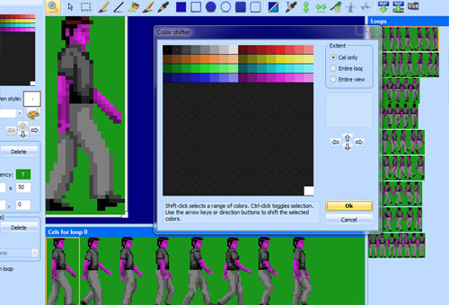
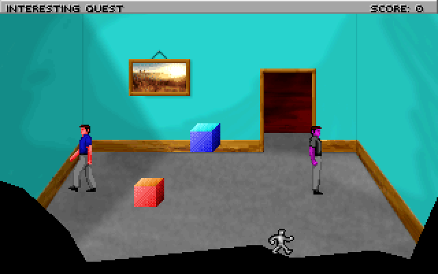
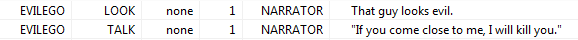

.. Actors

.. default - domain::js

.. include:: /includes/standard.rst

.. IMPORTANT:: SCI1.1 only.

====================================
Actors
====================================

Let's add another character! Open the template ego character, and **Save As** a new view resource (say view number 1).

Then use the shift color functionality to change the colors so he looks different. This evil ego will wear grey clothing and have purple skin.

Go into your room script file and add a new :class:`Actor` at the bottom::

    (instance evilEgo of Actor
        (properties
            view 1
            x 231
            y 131
            signal ignAct
            noun N_EVILEGO
        )
    )

Also add the N_EVILEGO to the message resource (you should be good at this now).

Now go up to the room's init() method and initialize the evil ego::

    (evilEgo:
        init()
        setCycle(StopWalk -1)
    )

:class:`StopWalk` is the standard Walk cycler that will switch to a special loop or different view when it is stopped. We don't have a different view,
but the ego view we used has a special 9th loop that is used for the stop pose. In this case, -1 says to use the final loop of the view as the stop pose.

Compile and run the game (you may need to **(use "StopWalk")**), and you should see the evil ego standing menacingly on the other side of the room.

Maybe give him some messages so you can look at him or talk to him:

Now let's make him wander around:

.. code-block:: python
    :emphasize-lines: 4

    (evilEgo:
        init()
        setCycle(StopWalk -1)
        setMotion(Wander)
    )

You'll need to **(use "Wander")**. Compile and run, and you'll see him wander around. **setMotion** sets a :class:`Motion` class on an :class:`Actor`. This
is used to control how the Actor moves.

You might notice that he'll walk right through walls. The :class:`Wander` Motion doesn't obey the room obstacles, so it's not very useful for us here.

The Motion classes that obey obstacles generally start with the letter P. So maybe we can use :class:`PFollow` instead:

.. code-block:: python
    :emphasize-lines: 4-5

    (evilEgo:
        init()
        setCycle(StopWalk -1)
        // Follow the ego to a distance of 20:
        setMotion(PFollow gEgo 20)
    )

Compile and run the game, and now he'll be following the ego around!! That's a bit scary, so let's slow him down:

.. code-block:: python
    :emphasize-lines: 4-5

    (instance evilEgo of Actor
        (properties
            view 1
            x 231
            y 131
            signal ignAct
            noun N_EVILEGO
            moveSpeed 30
            cycleSpeed 30
        )
    )

Now we at least have a chance to escape.