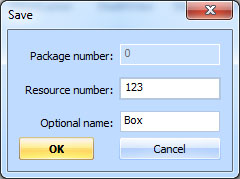
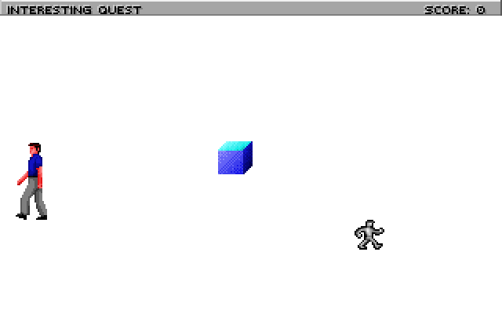
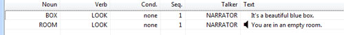
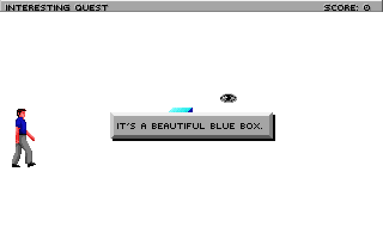
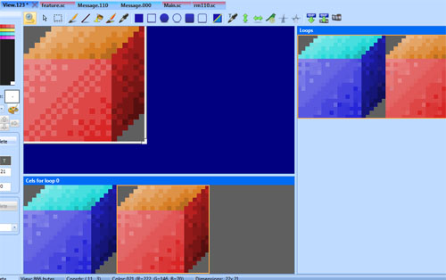
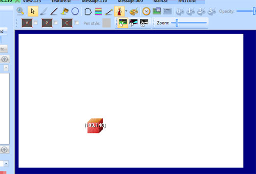
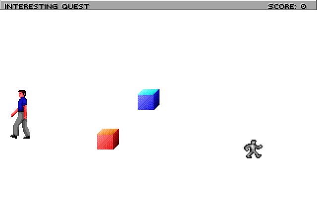
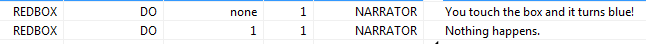

.. Interacting with Objects

.. default - domain::js

.. include:: /includes/standard.rst

.. IMPORTANT:: SCI1.1 only.

====================================
Interacting with Objects
====================================

This will show how to add an object to your room and interact with it.

Adding a Prop
=================

First, go to the Game Explorer, and add the Box sample from the Toolbox's *Insert view sample* menu. Give it resource number 123:

Next, go back to the rm110.sc script and place the cursor at the bottom. Right-click *InsertObject->Prop*. Give it a name *theBox*, and
set its view property to 123 (this is the Box view). It should look like this:

.. code-block:: python
    :emphasize-lines: 3

    (instance theBox of Prop
        (properties
            view 123
            x 150
            y 100
            signal ignAct
            loop 0
            cel 0
            noun N_NOUN
            priority 0
        )
    )

However, this won't compile properly yet, because we have given it a noun that doesn't exist. You can just remove the noun property altogether, but
we want to actually interact with this box. So go to the message resource for script 110 (use the *Messages* link in the Toolbox pane). Add a new
noun, and call it N_BOX (see :doc:`/messages` to learn how to do this). Save the message resource and return to the script. Set the noun property of *theBox* to N_BOX:

.. code-block:: python
    :emphasize-lines: 9

    (instance theBox of Prop
        (properties
            view 123
            x 150
            y 100
            signal ignAct
            loop 0
            cel 0
            noun N_BOX
            priority 0
        )
    )

We're not quite done yet! In addition to declaring a Prop, you need to initialize it. This makes sense, since you might not always want Props to appear right away in a room.
So go to the room's init() method and add this to the end::

    (theBox:init())

Now compile and run, and you should see the box in the center of the room:

Interacting with a Prop
========================

That was the hard part. Now the easy part.

Suppose we want to display a message when the player looks at the box. To do so, :doc:`add a message </messages>` for the LOOK verb on BOX:

Save the message resource and run the game, and try to look at the box:

The ego will turn to look at the box and the message will be displayed. Easy, right? You can add more messages to handle different verbs on the box.

Approach verbs
====================

Now, what if you want the ego to approach the box before it performs an action on it?

First, make sure you have a message for the **DO** verb on the box. Next, go to the place where you init() the box, and change it to this:

.. code-block:: python
    :emphasize-lines: 2

    (theBox:
        approachVerbs(V_DO)
        init()
    )

The approachVerbs method lets you list the verbs for which the ego will approach the object. You can specify multiple. Compile, run the game, and see that your ego will walk over to the box before the message appears. You also note, however, that
the ego walks *right* up to the box's position. Let's set an approach position so he's not on top of the box:

.. code-block:: python
    :emphasize-lines: 11,12

    (instance theBox of Prop
        (properties
            view 123
            x 150
            y 100
            signal ignAct
            loop 0
            cel 0
            noun N_BOX
            priority 0
            approachX 130
            approachY 110
        )
    )

Easier positioning
=====================

Specifying the exact coordinates to position things can be tedious. There's a better way.

Let's add another box. Open up view 123 (the blue box), and :doc:`add a new cel </views>` to the loop. Use the :ref:`color shifter <color-shifting>` to
make that new cel be red instead of blue:

Save the view and go to the pic for room 110. Enable the :ref:`fake-ego` and choose view 123 (the box). The blue box should appear on screen. Click on it
and press the right arrow key to cycle to the next cel, which should be your red cel.

Right-click on the box and choose *Copy*. This will copy its attributes to the clipboard.

Now, return to your script, and insert a new Prop (right-click, *Insert Object->Prop*) and call it *redBox*. It should *inherit* the view, cel, x and y properties from where you positioned the red box
on the pic!::

    (instance redBox of Prop
        (properties
            view 123
            x 109
            y 140
            signal ignAct
            loop 0
            cel 1
            noun N_NOUN
            priority -1
        )
    )

Make a new noun for it (e.g. N_REDBOX), add appropriate values for approachX and approachY, and init() it just like you did for theBox. Compile and run, and it should look like this:

Custom doVerb() handler
==========================

What are we going to do with this red box? We'll make it turn blue when you touch it.

That means we actually need to write some code to respond to a verb, instead of just displaying a message. To do this, you override the doVerb() method on an object.

Place the cursor inside the redBox Prop, and right-click *Insert Method->doVerb*. This adds the doVerb() method, with a default case that calls the super. We want to leave that in,
but add a case for **V_DO**, where we'll change the *cel* of the redBox. Cel 1 was red, but cel 0 was blue, remember? So it should look like this:

.. code-block:: python
    :emphasize-lines: 17-20

    (instance redBox of Prop
        (properties
            view 123
            x 109
            y 140
            signal ignAct
            loop 0
            cel 1
            noun N_REDBOX
            priority -1
            approachX 109
            approachY 130
        )
    
        (method (doVerb theVerb params)
            (switch (theVerb)
                (case V_DO
                    // Set it back to cel 0 to turn it blue.
                    (self:setCel(0))
                )
                (default 
                    (super:doVerb(theVerb rest params))
                )
            )
        )
    )

Compile and run. Now when the ego *touches* the red box, he'll walk over there and it will turn blue.

Now, if you also want to display a message when the box turns blue, you can invoke the message display system directly. First, add a message for when the
box is still red, and for when you've already turned it blue. We'll distinguish the messages by making use of the Condition property. The condition for the
format will be 0 (none), and for the latter it will be 1. 

Then change the doVerb method to look like this:

.. code-block:: python
    :emphasize-lines: 4-10

    (method (doVerb theVerb params)
        (switch (theVerb)
            (case V_DO
                (if (== 1 (self:cel))
                    (self:setCel(0))
                    (send gTestMessager:say(N_REDBOX V_DO 0 0))
                )
                (else
                    (send gTestMessager:say(N_REDBOX V_DO 1 0))
                )
            )
            (default 
                (super:doVerb(theVerb rest params))
            )
        )
    )

Now the narrator should tell you that the box turned blue. And when it's already blue, that nothing happened.