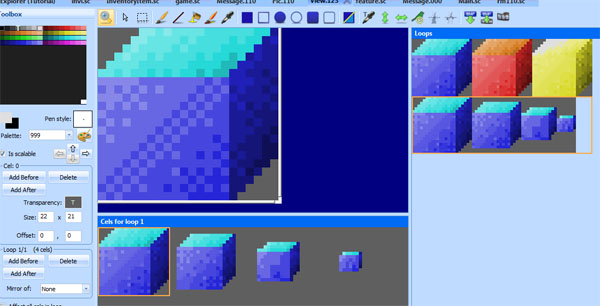

.. Animating props

.. default - domain::js

.. include:: /includes/standard.rst

.. IMPORTANT:: SCI1.1 only.

====================================
Animating props
====================================

This will show you how to use :class:`Cycle` objects to create animations.

A simple animation
-------------------

Remember that blue box? Go back to the box view, and add a third cel. Color shift it so it's yellow (or do whatever you want).

Go to your script file, and add at a setCycle method call to the box's initialization:

.. code-block:: python
    :emphasize-lines: 3

    (theBox
        approachVerbs: V_DO
        setCycle: Forward
        init:
    )

This uses the :class:`Forward` cycler to cycle forward through the loops cels. So when you run the game, the blue box will now cycle between
blue, red and yellow. Easy!

To adjust the speed, you can set a different cycleSpeed on the object:

.. code-block:: python
    :emphasize-lines: 13

    (instance theBox of Prop
        (properties
            view 123
            x 150
            y 100
            signal ignAct
            loop 0
            cel 0
            noun N_BOX
            priority 0
            approachX 130
            approachY 110
            cycleSpeed 15   // Large numbers are slower.
        )
    )

Triggering off animation events
-------------------------------------

Let's do something a little more complicated. Let's make the box shrink when the player touches it. Go back to view 123, and create a new loop.
When you create a new loop, by default it should contain the first cel of the previous loop (it has to contain something). That's great, it's our blue box.

Add three more cels to the loop. They should all have blue boxes in them by default.

Click on the second cel and resize the borders while holding down the SHIFT key (this makes resizing the borders grow or shrink the view inside). Make the box a *little* smaller.
Click on the third cel and make it even smaller, and so on. You should end up with something like this:

Now we'll write code that triggers off the ego performing the V_DO verb on the N_BOX. In that, we'll make the box cels cycle from beginning to end. To do that, we'll
need to do a few things:

- **Remove** the (theBox:setCycle(Forward)) we added in the previous section (in the room's init()).
- Make *theBox* use loop 1 by default (since that's where our shrinking box is).
- Add a doVerb method to *theBox*, and tell the box to cycle from beginning to end.

.. code-block:: python
    :emphasize-lines: 7,16-25

    (instance theBox of Prop
        (properties
            view 123
            x 150
            y 100
            signal ignAct
            loop 1
            cel 0
            noun N_BOX
            priority 0
            approachX 130
            approachY 110
            cycleSpeed 15
        )

        (method (doVerb theVerb)
            (switch theVerb
                (V_DO
                    (self setCycle: EndLoop)
                )
                (else
                    (super doVerb: theVerb &rest)
                )
            )
        )
    )

Compile and run the game to test it.

That's nice, but what if we want to display a message *after* the box has shrunk? This is where :class:`Script` objects come in (not to be confused with script files).
With a Script we can choreograph a sequence of events. We'll make a Script that has a state for shrinking the box, followed by a state for displaying a message. We'll attach
this Script to *theBox*.

First, create a new Script object (you can use *Insert Object->Script* for convenience)::

    (instance shrinkBoxScript of Script
        (properties)
    
        (method (changeState newState)
            (= state newState)
            (switch state
                (0)
            )
        )
    )

Then, replace our previous handling of *theBox* doVerb with a call to set the Script on the box:

.. code-block:: python
    :emphasize-lines: 4

    (method (doVerb theVerb)
        (switch theVerb
            (V_DO
                (self setScript: shrinkBoxScript)
            )
            (else
                (super doVerb: theVerb &rest)
            )
        )
    )

Now add some meat to the shrinkBoxScript.

.. code-block:: python
    :emphasize-lines: 7-18

    (instance shrinkBoxScript of Script
        (properties)
    
        (method (changeState newState)
            (= state newState)
            (switch state
                (0
                    (gGame handsOff:)
                    ; We could also say (theBox setCycle: EndLoop self)
                    (client setCycle: EndLoop self)
                )
                (1
                    (= seconds 2)
                )
                (2
                    (Prints {The box shrunk!})
                    (gGame handsOn:)
                )
            )
        )
    )

Ok, what is all that? First of all, *case 0* will be executed as soon as the Script is set on the box. So that will start the cycle to shrink the box. Note
that we added a **self** parameter to the setCycle call. This is a common thing for setCycle (and setMotion). It means that **self** will be *cued()* when
the cycle is finished. And what happenes when a Script is cued()? It's changeState() is called with an incremented *newState*. So basically this is saying: "when
we reach the End of the cycle, go to the next state".

The next state sets the Script's seconds to 2. So after 2 seconds, changeState will be called again with an incremented newState. In this final case, we print
some text to notify the player what happened (of course, we should probably use a message here).

We also put calls to handsOff and handsOn so that the player can't go and do something else while this short Script is executing (for instance, to prevent them from touching
the box again and re-triggering the Script).

Now, the player can keep touching *theBox* and it will appear large again and shrink down. Because that's what the :class:`End` cycle does: Starts from cel 0 and goes to the end.
So maybe we should handle that case.

Go to the top of the script and add a local variable::

    (local
        hasBoxShrunk = FALSE
    )

Then modify theBox:doVerb() like so:

.. code-block:: python
    :emphasize-lines: 4-10

    (method (doVerb theVerb)
        (switch theVerb
            (V_DO
                (if (not hasBoxShrunk)
                    (= hasBoxShrunk TRUE)
                    (self setScript: shrinkBoxScript)
                else
                    (Prints {What a small box!})
                )
            )
            (else
                (super doVerb: theVerb &rest)
            )
        )
    )

Now the box can only shrink once, and we can respond to V_DO with something else when the box is already shrunk.

switchto
-----------------

This might be a good time to introduce the switchto statement. It's just like a switch statement, except the cases are
implicitly number from 0 upwards. This can be useful if you're adding and removing lots of cases as you create your room scripts.

This is what shrinkBoxScript's changeState method looks like if we use a switchto::

    (method (changeState newState)
        (= state newState)
        (switchto state
            (
                (gGame handsOff:)
                ; We could also say (theBox setCycle: EndLoop self)
                (client setCycle: EndLoop self)
            )
            (
                (= seconds 2)
            )
            (
                (Prints {The box shrunk!})
                (gGame handsOn:)
            )
        )
    )

It doesn't look much different, but there's no chance we miss a state number when we're adding and removing states.