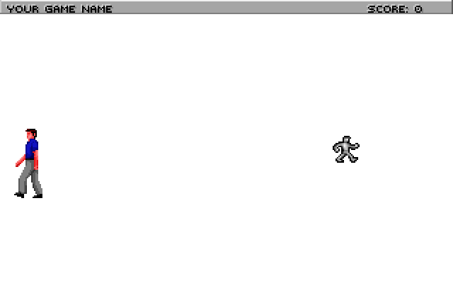

.. The first room

.. default - domain::js

.. include:: /includes/standard.rst

.. IMPORTANT:: SCI1.1 only.

====================================
The first room
====================================

By default, the TitleScreen.sc script takes you to room 110 when you click on the color button number 0:

.. code-block:: python
    :emphasize-lines: 3

    (switch (temp0)
        (case 0
            (send gRoom:newRoom(110))
        )
        (case 1
            (send gGame:restore())
            (self:changeState(state))
        )
        (case 2
            (= gQuitGame TRUE)
        )
    )

Room 110 is already set up for you. Find *rm110.sc* in the Quick links in the script editor, or open it from the Game Explorer.

When you run the game, your ego will appear on a blank white screen (pic 110). You can switch between the *walk*, *look*, *do* and *talk* cursors by right-clicking or
using the icon bar at the top. To move the ego around, click with the *walk* cursor.

The init() method
======================

Let's go through each of the pieces of code in init()::

    AddPolygonsToRoom(@P_Default110)

The above line adds the polygons defined with the pic resource to the room. Polygons define the boundaries of where the ego can go. (If you click
on the *pic 110* link in the Toolbox, pic 110 will open. Then click on *Show polygons* in the pic Toolbox, and you'll see a green rectangle outlined
on the pic. This is the single default polygon for this room). In subsequent tutorials we'll modify this to control where the ego can go.

Next, we have::

    (super:init())

Always remember to call (super:init()). It's responsible for drawing the background, among other things. Next, we have::

    (switch (gPreviousRoomNumber)
        // Add room numbers here to set up the ego when coming from different directions.
        (default
            SetUpEgo(-1 1)
            (send gEgo:
                posn(150 130)
            )
        )
    )
    (send gEgo:init())

This is responsible for placing the ego in different locations depending on what room they entered from. For now, we just have it set up
so that when the ego enters from any room to room 110, he'll be placed at (150, 130). SetUpEgo says to use the default view (-1), and loop 1 (facing west).

Try changing posn(150 130) to posn(20 130), and you'll see the ego appears at a different spot:

Finally, we have::

    // We just came from the title screen, so we need to call this to give control
    // to the player.
    (send gGame:handsOn())

Normally you wouldn't need to put this in your room's init(). But since we came from the TitleScreen where player input was disabled, we need to do this.

The room script
===================

Let's add a room script. Room scripts give the ability to handle state changes and execute code every game cycle. Place the cursor at the bottom of the
script file, right-click and choose *Insert Object->Script*. Name your script **RoomScript**:

.. code-block:: python
    :emphasize-lines: 1

    (instance RoomScript of Script
        (properties)

        (method (changeState newState)
            = state newState
            (switch (state)
                (case 0
                )
            )
        )
    )

Go to your room's init method, and assign the script to the room:

.. code-block:: python
    :emphasize-lines: 4
    
    (method (init)
        AddPolygonsToRoom(@P_Default110)
        (super:init())
        (self:setScript(RoomScript))

changeState(newState)
-----------------------

By default, when a script is assigned to a room, the *changeState* method will be called with newState equal to zero. So whatever code you put in in case 0 will
be executed. Try this, then compile and run:

.. code-block:: python
    :emphasize-lines: 8

    (instance RoomScript of Script
        (properties)

        (method (changeState newState)
            = state newState
            (switch (state)
                (case 0
                    TextPrint("Case 0!")
                )
            )
        )
    )

You'll note that the text actually comes up right away... before the room has actually been drawn! Let's modify the changeState method
by making it wait four seconds:

.. code-block:: python
    :emphasize-lines: 8

    (instance RoomScript of Script
        (properties)

        (method (changeState newState)
            = state newState
            (switch (state)
                (case 0
                    = seconds 4
                )
                (case 1
                    TextPrint("This is now case 1")
                )
            )
        )
    )

Setting the *seconds* property of a script will make it trigger the next state after that many seconds. You can also use the *cycles* property for
more fine-grained time.

In other tutorials we'll see other ways to trigger the next state (like when a certain game event happens), and you could also set a state directly using::

    (RoomScript:cue(5)) // Sets state 5

doit()
--------

Scripts also have a *doit()* method which is useful. This is called on every game cycle. To add this, position your cursor inside the *RoomScript* instance,
after the *changeState* method. Then right-click, *Insert Method->doit*::

    (method (doit)
        (super:doit())
    )

Now, suppose we wanted the ego to be magically transported back to the left side of the screen whenever they tried to walk past the center of the screen.
To do so, each game cycle we'd check to see if the ego's x position was large than 150. If so, we would position the ego back on the left side of the screen.
It would look like this::

    (method (doit)
        (var x, y)
        (super:doit())
        (= x (send gEgo:x))
        (= y (send gEgo:y))
        
        // If the ego is past 150
        (if (> x 150)
            // Then put him back at 20
            (send gEgo:posn(20 y))
        )
    )

Now compile and run, and try to walk the ego to the right side of the screen.

Title bar
----------------

At this point, you may have noticed that the status bar still has a default game name in it (the status bar wasn't visible on the TitleScreen, so we didn't notice it).
Open message resource 0 and find the the message with the TITLEBAR noun (or *Edit->Find in Files* and search for "Your game name"). In there, you'll see::

    Your game name                                             Score:

Change this to whatever you want, and modify the spacing if needed so that "Score:" still appears on screen.