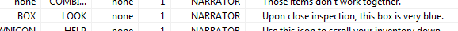
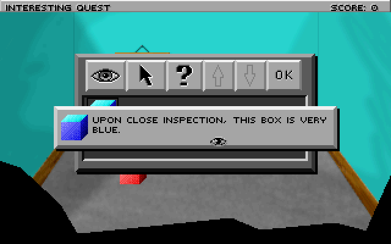

.. Managing the player's inventory

.. default - domain::js

.. include:: /includes/standard.rst

.. IMPORTANT:: SCI1.1 only.

====================================
Managing the player's inventory
====================================

Well, now that we have a small box, maybe we can put it in the player's inventory.

Open the :doc:`/Scripts/Inventory` script and scroll to the end. Here, create an inventory item for the box::

    (instance BlueBox of InventoryItem
        (properties
            view 123        // This is our box view, we'll re-use it
            loop 0
            signal $0002
            noun N_BOX
        )
    )

You'll need to add a BOX noun in this script's associated message resource. Note that this is different from the BOX noun we used before. Nouns are
specific to each "room" (unlike verbs, which are global). So this N_BOX is simply a way to refer to the box in the inventory script.

You may as well add a description of the box now (for the V_LOOK verb), in the inventory message resource:

Then, in **templateInventory** init() method in Inventory.sc, write the code that adds the item to the inventory list. There is a commented
out stub there in the template game:

.. code-block:: python
    :emphasize-lines: 4

        (self:
        	// Add inventory items here.
            // add(Money AThing AnotherThing)
            add(BlueBox)
            eachElementDo(#lowlightColor 2)
            add(invLook invSelect invHelp invUp invDown ok)
        )

This doesn't actually add the item to the player's inventory. It just adds it to the master inventory list.

We need to do one more thing to identify the inventory item. Scripts can't directory refer to instances in other scripts, so we need
to use the index of the inventory item. This is its position in the call to *add* in the above code. We're only adding one item at this
time, so it's zero-based index is just 0. We should assign a descriptive name to this though.

Open game.sh (via the *Quick links*, or by right clicking on (include "game.sh")) and opening it. **game.sh** contains all the game-specific defines. Go to the
end and add a section for inventory, where you'll define your inventory item indices. For now, it should look like this::

    // Inventory items
    (define INV_BOX					0)

Finally, we are ready to give it to the player. Go back to your room (script 110) and find the *doVerb* method of *theBox*. Add a call to the *get* method on gEgo.
This will give the ego the item.

.. code-block:: python
    :emphasize-lines: 10-11

    (method (doVerb theVerb params)
        (switch (theVerb)
            (case V_DO
                (if (not hasBoxShrunk)
                    (= hasBoxShrunk TRUE)
                    (self:setScript(shrinkBoxScript))
                )
                (else
                    TextPrint("The box is small now, so you can pick it up!")
                    (send gEgo:get(INV_BOX))
                    (theBox:hide())
                )
            )
            (default 
                (super:doVerb(theVerb rest params))
            )
        )
    )

Note that we also added a call to **(theBox:hide())**. theBox Prop is a completely different thing than the box inventory item, even if it
doesn't seem like it to the player. So we need to hide it from view when the player takes the box.

Compile and run the game. Now when you player touches the box, it should shrink. The next time they touch it, it will be placed in the player's inventory!

Open your inventory from the icon bar on top and you'll see it. You can then look at it to get a description:

Note that for completeness, we'd want to modify the code in the room's init() so that the box is never initialized in the first place if the player
has already taken it. That way if we re-enter the room the box won't be shown. You can check if the player has an item by doing::

    (if (not (send gEgo:has(INV_BOX)))
        // initialize it here (if the player doesn't have it)
    )

