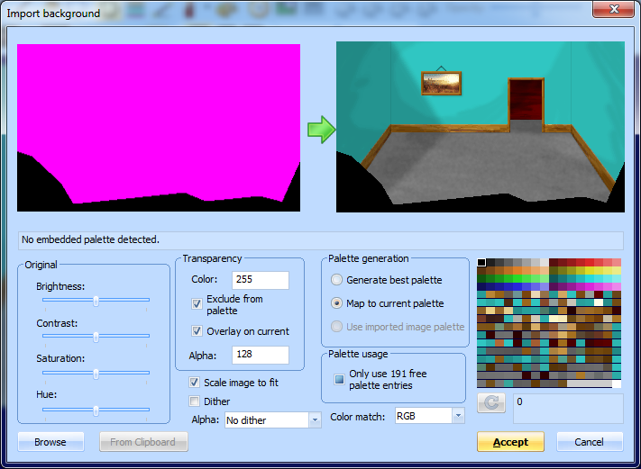
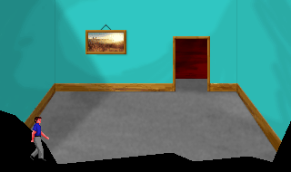
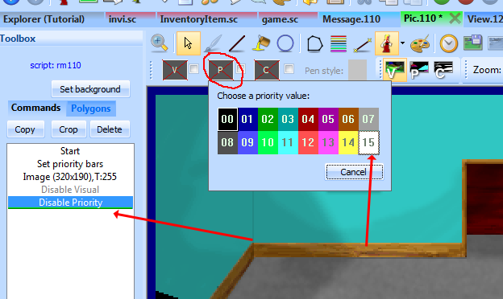
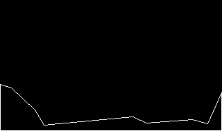
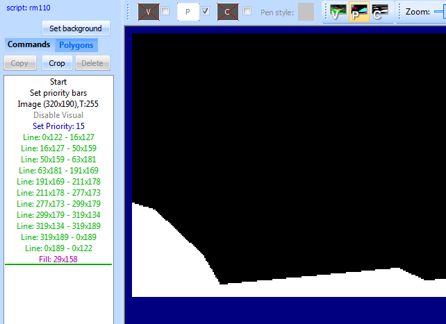
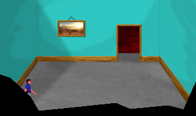

.. The priority screen

.. default - domain::js

.. include:: /includes/standard.rst

.. IMPORTANT:: SCI1.1 only.

====================================
The priority screen
====================================

Now let's get to one of the more tricky aspects, drawing the :ref:`priority screen <priority-screen>`. 

We'll provide a sort of partial wall, as if we're looking into the room in a movie set.
Go back to your pic, and :ref:`overlay <import-vga-overlay>` this image on it:

Make sure not to copy this image via the Windows clipboard, Windows doesn't preserve transparency. Click *Set background*
and browse specifically for this file. Check the *Overlay on current* box, and select *Map to current palette*.
Finally, since there isn't any black in the pic-specific colors, you might want to just select palette index 0 (top-left
corner of the palette) and click the refresh button. You should have something that looks like this:

Click Accept and the overlay will be merged into the pic image. SCI1.1 only supports a single background image per pic, so
it is now permanently fused to the original.

If you now turn on the fake ego and choose view 0 (which is the actual ego), when you drag it around, you'll notice it appears
on top of the black overlay:

Let's fix this.

Switch to the *Commands* tab in the pic Toolbox pane, and make sure the cursor is at the end of the commands. Then choose
to draw in a white priority color:

Now using the line tool, do your best to draw a line on the inner edge of the black overlay we added. The Helper pane on the right-hand
side is useful here; it shows you a zoomed in area around the cursor. You may want to switch the main view to show the priority screen. It should
look like this when you're done:

Now use the fill command to fill the rest of the area. Make sure there are no gaps!

Now if you switch back to the visual screen and turn on the fake ego again, you'll see that he disappears behind the wall:

Run the game and walk around to see the full effect.

We chose white as the priority color because it has the highest priority, so it will cover everything. If you had some static objects in the middle
of the room, you'd use an different priority color. You can turn on the priority bands in the pic editor to see the color you should use
for different y positions in the room. Generally, you should use the base of the object (e.g. the bottom of a table's legs) as a guide for what priority
to use.

This *is* one of the more tedious aspects of creating pic backgrounds, but it gives life to them.

