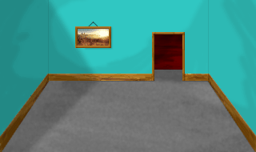
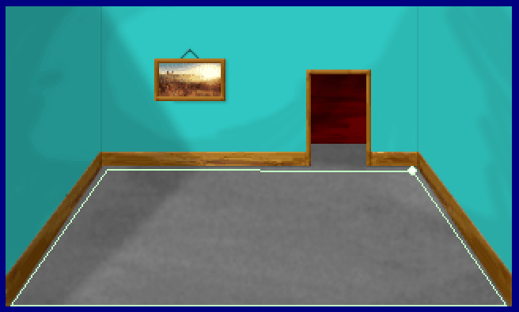
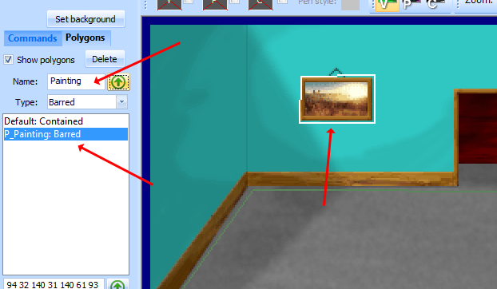
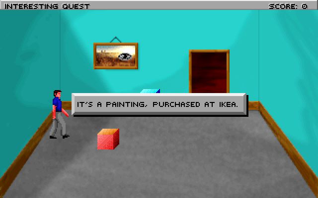

.. Adding a background

.. default - domain::js

.. include:: /includes/standard.rst

.. IMPORTANT:: SCI1.1 only.

=======================================
Adding a background and static objects
=======================================

Adding a background
=====================

Let's give our room a real background. Open pic 110, and click on *Set Background*. Import the following backgrond:

Then save the pic. Great, now we have what looks like a real room! However, the polygon that defines the room's boundary is incorrect.
Click on the polygon tool |polygon| and then select the Default polygon in the Toolbox pane.

Drag the polygon corners so they better align with the corners of the room, then save the pic. If you want, split the polygon edges and
extend the polygon a little ways up into the doorway at the back of the room.

Before running the game, go back to script 110 and change the ego's default start location to **posn(60 130)**, otherwise he will
probably be outside the room's polygon. Now run the game and walk around, and notice how the ego stays within the confines of the polygon,
and will walk along its edges.

Note that the polygon was a *Contained access* polygon, which indicates the ego should stay inside the polygon. You can also
add some *Barred access* default polygons which would be areas that the ego should avoid.

Some static objects with canned responses
============================================

Notice that painting on the wall? We can offer some limited interaction with it even though it's a static part of the background. To do
so, we'll first create a polygon for it.

Using the polygon tool, draw a line around the painting. Then give the polygon a name. *Named* polygons won't be added to the room's obstacles
in the init() method. Instead, we can assign them to individual features to define that feature's boundary. Also, note that the type (Barred, Contained, etc...) of the polygon
doesn't matter when we're using it to define the click boundaries of a feature.

Save the pic and come back to the script.

Let's add a :class:`Feature` for the painting. Place the cursor at the bottom of the script and right-click *Insert Object->Feature*, and give it the name **painting**. Also add a noun for this in the message editor,
say N_PAINTING. You can remove the onMeCheck property for now. So you should have something like this::

    (instance painting of Feature
        (properties
            x 150
            y 100
            noun N_PAINTING
        )
    )

Of course, we need to initialize it. Here is where we'll also associate the polygon with it. In the room's init() method, at the end, add::

    (painting:
        setOnMeCheck(omcPOLYGON CreateNewPolygon(@P_Painting))
        init()
    )

This tells the painting that a click should be "on me" if it is within the bounds of the polygon defined by P_Painting. P_Painting is defined in
the 110.shp header file that is included at the top of the script. This header file is written by the pic editor when you save a pic containing polygons.
If you want to look at it, right-click on the header file name and choose *open 110.shp*.

Now in the message editor, add some messages for N_PAINTING, say for the V_LOOK verb.

If you compile now, you might get an error that you need to use "Feature". The **use** statements at the top of the script list other scripts that contain
classes we reference. The :class:`Feature` class is in the Feature.sc script. So add this::

    (use Feature)

Now compile and run, and the ego should display the messages you added when interacting with the painting.

You might note that the ego doesn't face the painting properly. This is because even though a :class:`Feature` isn't an object placed at a specific location
(like a Prop), it still should have a valid x and y position. The position is used to determine the direct the ego faces when interacting with the feature.
So go back to the pic editor, and hover the mouse cursor over the floor near the painting. In the status bar you should see the pic coordinates, roughly (117, 104).
Go back and change the x and y values in the *painting* declaration to those values. Now the ego should face the correct direction when looking at the painting.

.. |polygon| image:: /images/PolygonTool.png