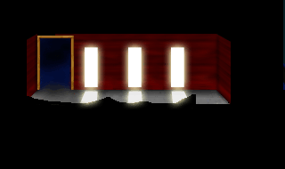
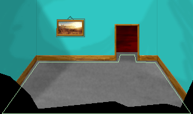
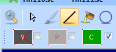
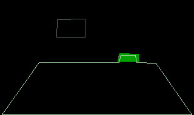

.. Adding a second room

.. default - domain::js

.. include:: /includes/standard.rst

.. IMPORTANT:: SCI1.1 only.

====================================
Adding a second room
====================================

Create a new empty pic and import the following background:

Save the pic as resource 111.

Next, create a new room (File -> New -> New Room) and make sure Room Number is set to 111. Accept the rest of the defaults.

Connecting the rooms
=========================

Go back to pic 111 and extend the polygon into the back door a bit:

You can do this by choosing the polygon tool, selecting the Default polygon in the Toolbox back, and then manipulating the
polygon edges and points. Right clicking on an edge will allow you the option of splitting the edge (creating a new point). You
can then drag the point as you please.

Once you've done that, you need to draw a control area that will be the trigger to go to the next room. Choose the line tool, and
make sure the visual and priority are disabled. Choose green as your control color (02). The pen state should look something like this:

Switch to the priority screen, and draw 4 connected lines roughly in the area of the doorway. If you leave on "Show Polygons", you can use that
as a guide as to where to draw. Make sure they form an enclosed quadrilateral, then choose the fill tool and click in the middle of your
quadrilateral (if your lines weren't fully enclosed, the fill will leak out into the whole image). It should look something like this:

Save the pic and return to the room 110 script. Go to the RoomScript class and find the **doit** method. Remember, this is code that is executed
every game cycle. So all we have to do is ask (every game cycle) is: Is the ego on green? If so, send him to room 111. This can be accomplished like so:

.. code-block:: python
    :emphasize-lines: 2-4

    (method (doit)
        ; If the ego is on green
        (if (& (gEgo onControl:) ctlGREEN)
            (gRoom newRoom: 111) ; change the room to 111
        )
        (super doit:)
    )

To make things easier, let's disable the evil ego for now. Comment out the call to **setMotion:** for the evilEgo. Now compile and run the game.
Walk up through the doorway, and you'll be transported to room 111 (be careful not to walk too close to the evil ego - he can still kill
you even if he's not following you).

You'll notice however, that you appear in the center of the room (and that you can walk through walls). Let's fix that. Go to room 111 and find
the room's **init** method. In there, there is a switch statement that is responsible for setting the ego's position and direction depending on
which room it came from. Add a case for coming from room 110:

.. code-block:: python
    :emphasize-lines: 2-5

    (switch gPreviousRoomNumber
        (110
            (SetUpEgo -1 3) ; 3 is the loop of the ego where he's facing up.
            (gEgo posn: 234 111) ; this is the position of the ego
        )
        (else 
            ; Set up ego view and loop (direction)
            (SetUpEgo -1 0)
            (gEgo posn: 150 100)
        )

Now run the game, and the ego should appear in a sensible place when he enters the room.

Now, you'll want to do the same thing for coming back to room 110 *from* room 111. To summarize:

    - add an area of green (or whatever your choice) control color in pic 111. This will be the trigger.
    - in room 111's RoomScript, add logic in the **doit** method to send the ego to room 110 when he's on the control color.
    - add a case in room 110's Room **init** method for when the ego comes from room 111 ((gEgo posn: 212 113) is a good choice).

Run the game and you should be able to walk between room 110 and 111. You'll probably want to add a *Contained* polygon to room 111 so the ego can't
walk through walls.

.. NOTE::
    You'll need to make sure the ego isn't on the room change control color when he enters the room, or you'll immediately be sent back!

Transitions
===============

You can set visual transitions (fades, slides, etc...) when you go between rooms. The transition that runs is the one that is specified in the **style** property
of the Room. To see the different kinds, look at the dp\* defines in sci.sh. For more details see :ref:`room-transitions-label`.

For now, try this:

.. code-block:: python
    :emphasize-lines: 9

    (instance rm111 of Room
        (properties
            picture scriptNumber
            north 0
            east 0
            south 0
            west 0
            noun N_ROOM
            style (| dpOPEN_TOP dpANIMATION_BLACKOUT)
        )
        ...

Note that since we're using different background palettes between the rooms, it is important to specify dpANIMATION_BLACKOUT. This makes sure
one screen completely transitions off before the other begins transitioning on. Otherwise, you'll get weird colors showing up.

.. NOTE::
    If you need different transitions depending on which room you came from, you can set the style manually in the room's **init** method, *before*
    the call to (super init:).

Bonus
==========

If you have shrunk the box (but haven't picked it up), you'll notice that when the ego returns to room 110 that it still shows the large box.
You'll also note that if the ego is *carrying* the box, it still shows up on the ground. So we need to add a little more logic to room 110's **init** method.
Find where the box is initialized, and add the following:

.. code-block:: python
    :emphasize-lines: 2-9

    (theBox approachVerbs: V_DO init:)
    (if (Btest F_ShrunkBox)
        ; Set the box to the last animation cel
        (theBox setCel: 1000)
    )
    (if (gEgo has: INV_BOX)
        ; hide it if the ego is carrying it
        (theBox hide:)
    )

You'll notice that we can leverage the F_ShrunkBox global flag we added. If we used a variable that was local to room 110, it would be reset when we came back in.
Setting the cel to some large number is a little trick that will actually set it to the final cel in the loop (which is the one that show it small).
