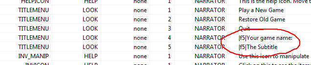
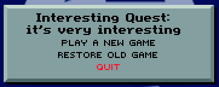
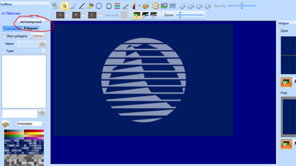
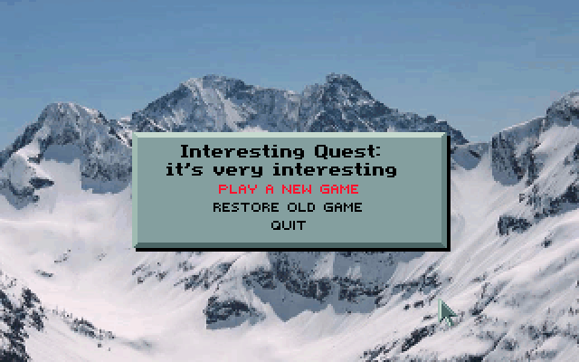

.. Customizing the title screen

.. default - domain::js

.. include:: /includes/standard.rst

.. IMPORTANT:: SCI1.1 only.

====================================
Customizing the title screen
====================================

When you create a new game, the script editor will be opened to the title screen script. The default title screen logic shows
a background image for 4 seconds, then display a menu on top of it after that time (or when any mouse button or keyboard key is pressed).

Changing the game name
-------------------------

Let's put the name of your game in the title screen. If you go to the *changeState* method of the *rmScript* class, you'll see
a call to :class:`Print` that adds two lines of text and three buttons. We want to change what the *addText* calls point to::

    addText(N_TITLEMENU V_LOOK 0 4 0 0 0)

The parameters passed to addText are: noun, verb, condition, sequence, x, y and module number. Module number indicates which message
resource the text is contained in.

Almost all text in SCI1.1 games comes from message resources. So to change this, we don't actually need to edit the script. Instead, we'll edit
the message resource.

Normally for a room, the message resource number 
is the same as the room number. However, in the TitleScreen room, we're using message resource 0.

Open up :doc:`message resource 0 </messages>` from the Game Explorer and search for N_TITLEMENU. N_TITLEMENU is just an arbitrary noun. These are used
to identify a particular message entry. The same goes for V_LOOK. Nouns and verbs will feel more natural when we start interacting with objects.

Click on the entries for Seq: 4 and 5 (which were the values passed to addText), and modify the text in the message details section. Save the message resource, the run the game, and you should see your changes.

Of course, if you really want, you can also put the text directly in the call to addText::

    //addText(N_TITLEMENU V_LOOK 0 4 0 0 0)
    addText("Direct Quest" 0 0)
    //addText(N_TITLEMENU V_LOOK 0 5 0 10 0)
    addText("A subtitle" 0 10)

Changing the background image:
--------------------------------

To change the background image, open the pic resource by clicking on the pic quick link in the Toolbox pane of the script editor (or by going to the Game Explorer and opening pic 100).
You'll see the background image.

To change it, click the *Set background* button, and :ref:`find a new picture to use <import-vga-background>`. Change the settings until your image looks right (you may
need to select *Scale image to fit*), then click *Accept* and save the pic. Run the game and
you should have a new background image.

Extra credit
---------------------

See if you can figure out how to add more button links to the title dialog, or change their highlight color (If you right-click on addText or addButton, you can
go see the definition of them to see what the various parameters do). The color indices used in the call to addColorButton will refer to the palette for the background pic (and
the first 64 colors should be shared with the global palette 999).

