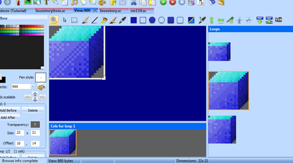
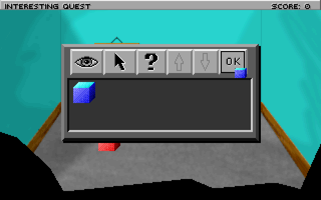
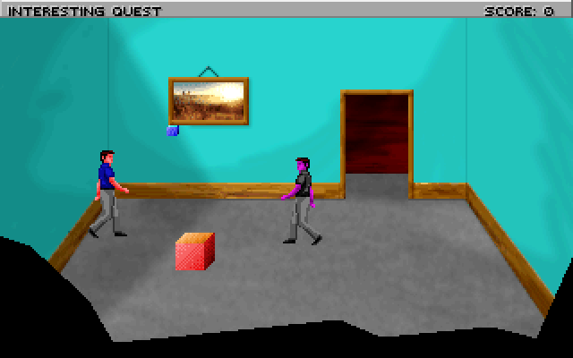

.. Using inventory items

.. default - domain::js

.. include:: /includes/standard.rst

.. IMPORTANT:: SCI1.1 only.

====================================
Using inventory items
====================================

Let's find a way to kill the zombie evil ego.

First, let's beef up our blue box inventory item a bit. The template game comes with a view that is a good template for an inventory item, this is view 900 (which is a coin).
Since we don't need the coin, open up view 900 and change it so it looks like the blue box. The first loop will be the cursor used when we use the blue box, the second loop
will be the image of the box in the zoomed-in inventory description, while the third loop will be the image of the box in the inventory list. It should look something like this:

If you're lazy, you can just use the original coin image for now.

Next, we'll want to add a verb for the inventory item. This is the verb that will be used when we use the item in the game. To do this, open any message resource
and add a new verb in the Toolbox pane. Let's just call it V_BOX for now.

Go into Inventory.sc and change the view property for the BlueBox, and add a cursor propery. Also add the verb for the **message** property:

.. code-block:: python
    :emphasize-lines: 3-5,8

    (instance BlueBox of InventoryItem
        (properties
            view 900
            cursor 900
            loop 1
            signal $0002
            noun N_BOX
            message V_BOX
        )
    )

Compile and run the game. Now when you have the blue box in your inventory, you can open the inventory, select it and hit Ok.

    You're ready to do something with this box!

Let's say throwing the box on the evil ego will kill him. Go the the evilEgo instance in your room and add a doVerb method::

    (method (doVerb theVerb params)
        (switch (theVerb)
            (case V_BOX
                TextPrint("You kill the evil ego with the box!")
                (self:hide())
            )
            (default 
                (super:doVerb(theVerb rest params))
            )
        )
    )

Well, that explains how to use an inventory object (try to go to the message resource and add more messages for what happens if you attempt to
use the box on yourself, the room or the other box), but it's not too visually impressive. For extra points, what about if we actually showed the box being thrown?

That's not too difficult. There is a :class:`JumpTo` Motion that is useful for this. First though, we'll need to make *theBox* an Actor (since only Actors have Motions):

.. code-block:: python
    :emphasize-lines: 1

    (instance theBox of Actor
        (properties
        // etc...

Next, as we did once before, we'll replace our V_BOX handler with a call to set a script on the evil ego.

.. code-block:: python
    :emphasize-lines: 4

    (method (doVerb theVerb params)
        (switch (theVerb)
            (case V_BOX
                (self:setScript(throwBoxScript))
            )
            (default 
                (super:doVerb(theVerb rest params))
            )
        )
    )

And the script we'll make looks like this::

    (instance throwBoxScript of Script
        (properties)

        (method (changeState newState)
            = state newState
            (switch (state)
                (case 0
                    (send gGame:handsOff())
                    (send gEgo:put(INV_BOX))    // Remove from inventory.
                    (theBox:
                        posn((send gEgo:x) (send gEgo:y) 30)
                        show()
                        setMotion(JumpTo (evilEgo:x) (evilEgo:y) self)
                    )
                )
                (case 1
                    (evilEgo:hide())
                    (send gGame:handsOn())
                    // Box hangs in the air for a couple of seconds for comedic effect
                    (= seconds 2)
                    (theBox:
                        posn((theBox:x) (- (theBox:y) 30) 0)
                    )            	
                )
                (case 2
                    (theBox:
                        setMotion(JumpTo (theBox:x) (+ (theBox:y) 30) self)
                    )
                )
            )
        )
    )

What does this do? In state 0, it removes control of the game from the player. Second, the box is removed from his inventory.

Next, the box is positioned at the player's location and is shown (we made it invisible when it was picked up, remember?). Now, for extra effect, the box is raised
up 30 pixels in the air so it's roughly at the ego's hands. The third parameter to **posn()** is the z-coordinate. The z-coordinate makes it like stuff is floating in the
air. The y-coordinate could be changed instead, but that would mess up hit detection. We want the box's (x, y) position to be the ground 30 pixels below where it appears.

We then invoke the JumpTo motion on *theBox*, passing **self** so that this Script's changedState is triggered when the JumpTo motion finishes. That brings us to state 1.

In state 1, the evil ego is hidden (he's killed), game control is returned to the player. For effect, we swap the y and z coordinates so the box it *appears* in the same place, then
we wait a few seconds and invoke another JumpTo motion to make it fall to the ground. The correct thing might be to make a motion that simulates gravity by changing the z-coordinate
increasingly quickly until the object is at z = 0. But we just used the JumpTo motion for expediency.

Now that the box is on the ground, the ego can even pick it up again!

    The box in mid-air. Showdown!